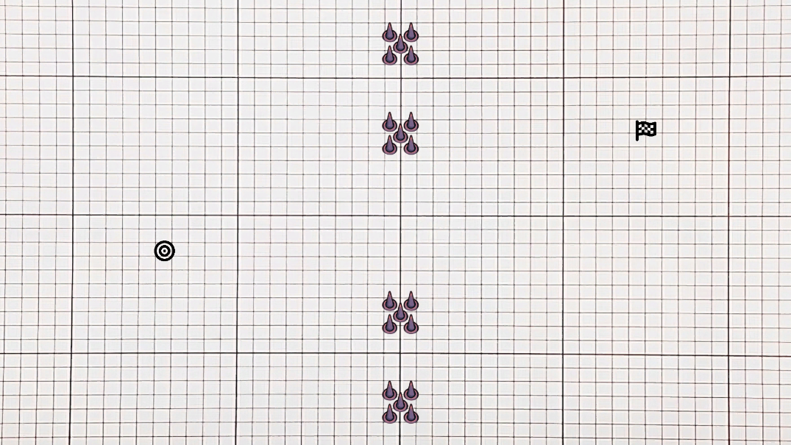

# The Line - Unity Project

**The Line** is a challenging and engaging single-player game where players must draw a line to navigate from point A to point B without touching their own line or any obstacles. Compete for the top spot on the leaderboard and remember time is of the essence!

---

## Table of Contents
- [The Line - Unity Project](#the-line---unity-project)
  - [Table of Contents](#table-of-contents)
  - [Screenshots](#screenshots)
  - [Game Controls](#game-controls)
  - [Features](#features)
  - [How to Play](#how-to-play)
  - [Run \& See Database](#run--see-database)
  - [Getting Started](#getting-started)
    - [Prerequisites](#prerequisites)
    - [Installation](#installation)
    - [Unity Setup](#unity-setup)
    - [External Libraries/Assets](#external-librariesassets)
  - [Development Environment](#development-environment)
  - [How to Contribute](#how-to-contribute)
  - [Known Issues](#known-issues)
  - [License](#license)
  - [Attribution](#attribution)

---

## Screenshots

- **Main Menu**
  

- **First Level**
  

- **Leaderboard**
  

---

## Game Controls
- **Left Mouse Click:** Start drawing a line.
- **Hold Left Mouse Click and Move the Mouse:** Determine the path of the line.

---

## Features
- **Line Drawing Mechanics:** Smooth and responsive line-drawing controlled by mouse input.
- **Level Progression:** Advance through increasingly challenging levels.
- **Obstacle Avoidance:** Strategically maneuver to avoid obstacles in the path.
- **Timer Challenge:** Complete each level before time runs out.
- **Time Collectibles:** Pick up collectibles to gain bonus time.
- **Leaderboard:** Compete against other players and track your performance.
- **Dynamic Gameplay:** Test your skills as levels become progressively harder.

---

## How to Play
1. **Click and Hold the Left Mouse Button:** Begin drawing a line at the starting point.
2. **Guide the Line:** Use the mouse to trace a path from point A to point B.
3. **Avoid Obstacles:** Ensure your line doesn’t touch obstacles or its own trail.
4. **Time is Key:** Reach the goal as quickly as possible to secure a top spot on the leaderboard.
5. **Resolution** Play on Full HD (1920 x 1080) with a scale of 0.58x is recommended.

## Run & See Database
1. **Make Connection with Database:**  
   `PS C:\Users\alexa\OneDrive\Bureaublad\EHB\DEV\TheLine\TheLineAPI> dotnet run`
2. **MongoDB Link:**  
   `mongodb+srv://<name>:<password>@theline.aibwn.mongodb.net/?retryWrites=true&w=majority&appName=TheLine`
3. **Name & Password:** Found in the remark box of the assignment.

---

## Getting Started

Follow the steps below to set up the project locally:

### Prerequisites
Before starting, ensure you have the following installed:
- **Unity Hub**: [Download Unity Hub](https://unity.com/download)
- **Unity Editor**: Use **Unity version 2022.3.30f1** (or later).

### Installation
1. Clone the repository:
   ```bash
   git clone https://github.com/EHB-MCT/TheLine.git

### Unity Setup
   - Clone this repository and open the project in Unity.
   - Ensure you are using **Unity version 2022.3.30f1** (or later).
   - All assets and scripts should be automatically imported.

### External Libraries/Assets
   - **TMP Essential Resources**: For text rendering in the game.

## Development Environment
- **Unity Version**: Unity 2022.3.30f1
- **External Libraries/Assets**: TMP Essential Resources

## How to Contribute
- Fork this repository and submit a pull request with your changes.
- see the [CONTRIBUTING.md](CONTRIBUTING.md) file for details.

## Known Issues
- Some issues with line redrawing from the StartPoint.
- Timer display bugs in the main menu & Leaderboard

## License
This project is licensed under the Apache License - see the [LICENSE.md](LICENSE.md) file for details.

## Attribution

**Erasmus Hogeschool Brussel & Jan Everaert**
- A sincere thank you for providing the opportunity to work on this project.
- Thank you for offering valuable advice and helping me overcome challenges.

**Friends & Family**
- Many thanks for testing the game and providing valuable user feedback.

**Special thanks to Kozmobot Games for providing a youtube tutorial**

- How to Make a TIMER Between Scenes in UNITY
- Watch on YouTube: https://www.youtube.com/watch?v=GNnG13nv-Sc&t=172s

**Special thanks to RobertBrooks for providing sprites**

- Implementing obstacles as sprites
- View Asset Pack: https://www.construct.net/en/game-assets/graphics/asset-packs/2d-top-down-floor-spikes-4060

**Special thanks to ChatGPT for support on various parts of the project**

- Implementing Basic Line Drawing Functionality  
  https://chatgpt.com/c/6752c967-8378-8003-a5f2-b68fd6786160

- Overview of Git Branching  
  https://chatgpt.com/c/6752b2b7-b1a8-8003-9bbe-fd6f92327cc8

- Writing Clear and Effective Commit Messages  
  https://chatgpt.com/c/67404ab9-97a4-8003-b321-d76805c5c309

- Configuring and Understanding Git Remotes  
  https://chatgpt.com/c/67122e10-9ab4-8003-891c-40ba974c6a7e

- Enhancing Line Drawing with Advanced Features  
  https://chatgpt.com/c/6769707a-68dc-8003-8c85-61c02148beea

- Implementing Level Transitions and Scene Management  
  https://chatgpt.com/c/6769779c-4700-8003-a996-2b99acf70fc2

- Transitioning to the Next Level After Completion  
  https://chatgpt.com/c/6769980e-5364-8003-99a6-6769b0a9b19d

- Creating and Managing a Game Timer  
  https://chatgpt.com/c/676d951c-59a4-8003-8d3e-ac110fc89c0c

- Handling Obstacle Collisions  
  https://chatgpt.com/c/676dcbb2-7604-8003-89bf-024142750950

- Game Over Logic and Implementation  
  https://chatgpt.com/c/676ed908-46b8-8003-bc54-53d015baa84f

- Logic for Winning the Game  
  https://chatgpt.com/c/676f1b47-406c-8003-97ff-92b48308e117

- Adding Final Touches to Line Drawing Functionality  
  https://chatgpt.com/c/676f3145-fc48-8003-923d-5db88b250c7e

- Refactoring Code for Improved Readability and Performance  
  https://chatgpt.com/c/67700304-f034-8003-951a-8a33680cb518

- Organizing and Optimizing Directory Structure  
  https://chatgpt.com/c/67714998-b8ec-8003-b973-3eb1a47cbea3

- Game Manager & Player Stats
  https://chatgpt.com/share/677b31d9-3034-8008-9c4c-3f5599626d44

- MongoDB Service Implementation
  https://chatgpt.com/share/677b3222-1b80-8008-bdef-106c39729bbb

- Unity MongoDB API Integration
  https://chatgpt.com/share/677b3266-5290-800a-952c-8d8eb82b483f

- Level Completion Logic
  https://chatgpt.com/share/677b32c5-fcf8-800a-b01b-ecbc288c1820