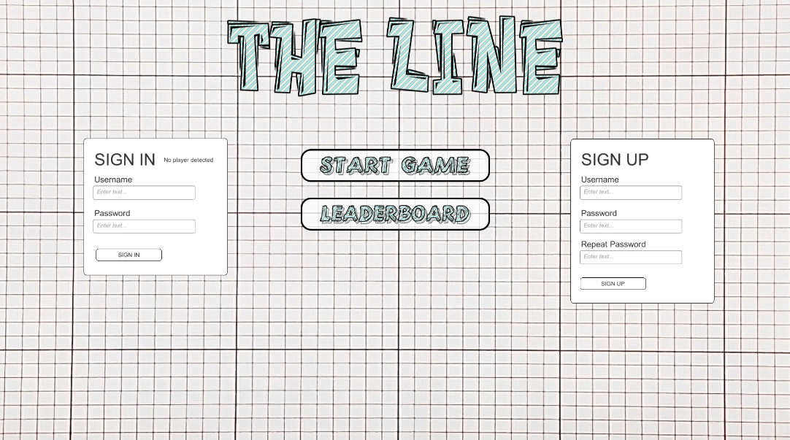

# The Line - Unity Project

**The Line** is a challenging and engaging single-player game where players must draw a line to navigate from point A to point B without touching their own line or any obstacles. Compete for the top spot on the leaderboard and remember—time is of the essence!

---

## Table of Contents
- [The Line - Unity Project](#the-line---unity-project)
  - [Table of Contents](#table-of-contents)
  - [Screenshots](#screenshots)
  - [Game Controls](#game-controls)
  - [Features](#features)
  - [How to Play](#how-to-play)
  - [Getting Started](#getting-started)
    - [Prerequisites](#prerequisites)
    - [Installation](#installation)
    - [Unity Setup](#unity-setup)
    - [External Libraries/Assets](#external-librariesassets)
  - [Development Environment](#development-environment)
  - [How to Contribute](#how-to-contribute)
  - [Known Issues](#known-issues)
  - [License](#license)
  - [Attribution](#attribution)

---

## Screenshots



---

## Game Controls
- **Left Mouse Click:** Start drawing a line.
- **Hold Left Mouse Click and Move the Mouse:** Determine the path of the line.

---

## Features
- **Line Drawing Mechanics:** Smooth and responsive line-drawing controlled by mouse input.
- **Level Progression:** Advance through increasingly challenging levels.
- **Obstacle Avoidance:** Strategically maneuver to avoid obstacles in the path.
- **Timer Challenge:** Complete each level before time runs out.
- **Time Collectibles:** Pick up collectibles to gain bonus time.
- **Leaderboard:** Compete against other players and track your performance.
- **Dynamic Gameplay:** Test your skills as levels become progressively harder.

---

## How to Play
1. **Click and Hold the Left Mouse Button:** Begin drawing a line at the starting point.
2. **Guide the Line:** Use the mouse to trace a path from point A to point B.
3. **Avoid Obstacles:** Ensure your line doesn’t touch obstacles or its own trail.
4. **Time is Key:** Reach the goal as quickly as possible to secure a top spot on the leaderboard.

---

## Getting Started

Follow the steps below to set up the project locally:

### Prerequisites
Before starting, ensure you have the following installed:
- **Unity Hub**: [Download Unity Hub](https://unity.com/download)
- **Unity Editor**: Use **Unity version 2022.3.30f1** (or later).

### Installation
1. Clone the repository:
   ```bash
   git clone https://github.com/EHB-MCT/TheLine.git

### Unity Setup
   - Clone this repository and open the project in Unity.
   - Ensure you are using **Unity version 2022.3.30f1** (or later).
   - All assets and scripts should be automatically imported.

### External Libraries/Assets
   - **TMP Essential Resources**: For text rendering in the game.

## Development Environment
- **Unity Version**: Unity 2022.3.30f1
- **External Libraries/Assets**: TMP Essential Resources

## How to Contribute
- Fork this repository and submit a pull request with your changes.

## Known Issues
- Some issues with line redrawing from the StartPoint.
- Timer display bugs in the main menu & Leaderboard

## License
This project is licensed under the Apache License - see the [LICENSE.md](LICENSE.md) file for details.

## Attribution

Special thanks to .